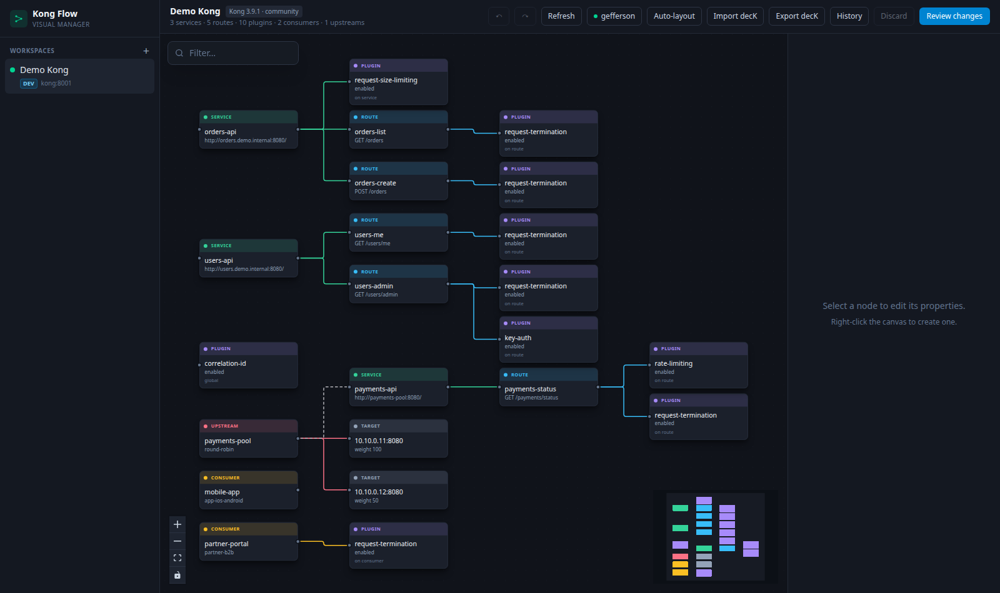
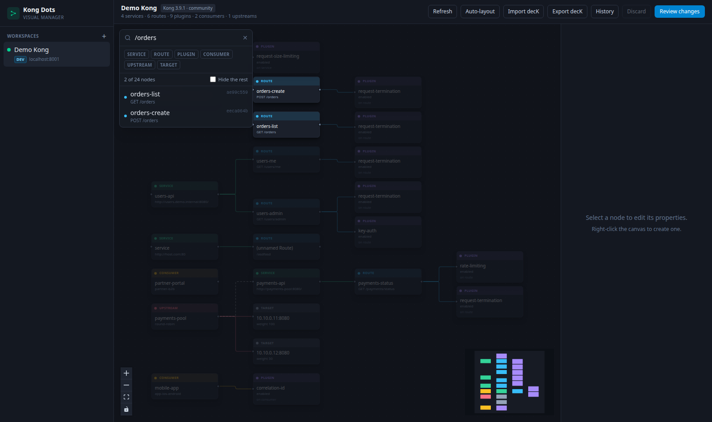
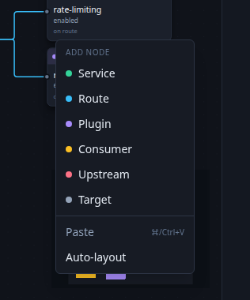
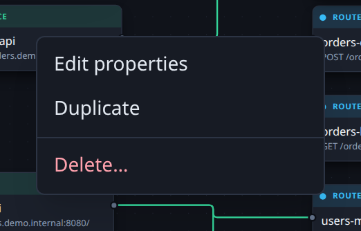
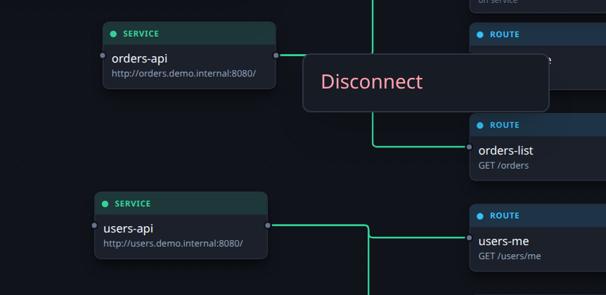
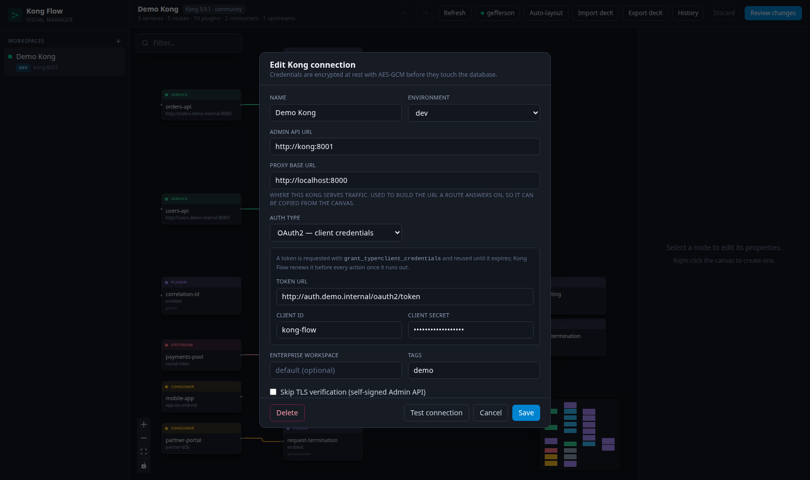

# Kong Dots

A Node-RED–style visual manager for **multiple Kong API Gateways**. Each registered Kong is a
workspace; inside it the topology (Services, Routes, Plugins, Consumers, Upstreams, Targets) is a
canvas of nodes wired by their real Admin API relationships — and it is editable, not just a viewer.

Implements the MVP in [SPEC.md](SPEC.md).



## What works today

| Spec item | Status |
|---|---|
| Register N Kongs, test connection, switch workspace | ✅ |
| Admin API auth: none, API key, RBAC token, bearer, basic, **OAuth2 client credentials** | ✅ |
| Filter the canvas by name or uuid, per entity kind | ✅ |
| Auto-rendered graph (services, routes, plugins, consumers, upstreams, targets) | ✅ |
| Dynamic plugin property form from `/schemas/plugins/{name}` | ✅ |
| Create / edit / delete nodes, drag-to-connect, cascade-aware delete | ✅ |
| Validation of what Kong requires, before an apply is attempted | ✅ |
| Draft state + `terraform plan`-style diff before touching Kong | ✅ |
| Apply in dependency order, live progress over WebSocket, apply history | ✅ |
| Export **and** import decK `kong.yaml` | ✅ |
| Canvas layout persisted per Kong (dagre auto-layout for anything new) | ✅ |
| Automatic rollback on partial failure | ❌ — apply stops at the first error and logs it (per spec §10.5) |
| Konnect, RBAC/multi-user, K8s ingress | ❌ — post-MVP |

Editing is always two-phase: the canvas is a **draft**, and nothing reaches the Admin API until
*Review changes → Apply*. The plan is recomputed against the live state at apply time, so a stale
diff can never be applied.

Two rules protect the draft:

* **Nothing incomplete is sent.** A Service with no host, a Route with no matcher, a Target with no
  Upstream — the canvas flags these on the node, in the property panel and in the review panel, and
  refuses to apply until they are resolved, instead of letting Kong reject them mid-run.
* **A failed apply never costs you work.** Whatever Kong refused or skipped stays on the canvas,
  still wired up and still pending; only what actually succeeded is replaced by Kong's own copy.

## Quick start — demo stack

One command brings up Kong 3.9.1, a seeded topology and Kong Dots itself:

```bash
cp .env.example .env      # optional: set KONGDOTS_SECRET_KEY
make demo
```

| | URL |
|---|---|
| **Kong Dots UI** | **http://localhost:8080** |
| Kong proxy | http://localhost:8000 |
| Kong Admin API | http://localhost:8001 |

The workspace **Demo Kong** registers itself, so the canvas is populated on first load.

Every seeded route answers with **canned JSON via the `request-termination` plugin**, so nothing
real has to be running behind the gateway:

```bash
make demo-check
GET    /orders                -> 200 {"data":[{"id":"ord_1001","customer":"mobile-app",…
POST   /orders                -> 201 {"id":"ord_1003","status":"created",…
GET    /users/me              -> 200 {"id":"usr_42","username":"mobile-app",…
GET    /users/admin           -> 401 {"message":"No API key found in request"…
GET    /payments/status       -> 503 {"error":"payments provider under maintenance",…
```

The topology is deliberately built to show every node type and plugin-ordering effect:

* `orders-api` — two routes with dummy `200`/`201` bodies, plus a service-scoped
  `request-size-limiting`.
* `users-api` — `/users/me` returns a dummy user; `/users/admin` also carries `key-auth`, which has
  a higher priority than `request-termination` and therefore answers **401** before the dummy body
  is ever produced.
* `payments-api` — points at the **Upstream** `payments-pool` by name (the dashed edge on the
  canvas) and its route pairs `rate-limiting` (5/min) with a dummy **503**, so the 6th call in a
  minute becomes a **429**.
* Consumers `mobile-app` and `partner-portal`, the latter with a consumer-scoped dummy `429`.
* A global `correlation-id`.

Re-running `make demo` is safe — the seed upserts by name and pins plugin ids.
`make demo-down` removes everything, volumes included.

## Quick start — development

```bash
make demo-kong   # only Kong + the demo data, on :8000 / :8001
make api         # backend on :8080
make ui          # Vite dev server with hot reload
```

Open **http://localhost:5173**. Or skip Vite and serve everything from the Go binary on
**http://localhost:8080** with `make serve`.

Register a Kong by clicking **+** in the sidebar (`http://localhost:8001`, auth *None*).
Run the tests with `make test` (`make test-backend` / `make test-frontend` individually).

## Deployment

```bash
docker compose up -d --build
```

One container: the Go binary serves the built SPA and the API on `:8080`, with SQLite in the
`kong-dots-data` volume. The port is published on loopback only — put it behind the same
Cloudflare Tunnel / Zero Trust as the rest of your services rather than exposing it directly.

### Configuration

| Variable | Default | Purpose |
|---|---|---|
| `KONGDOTS_ADDR` | `:8080` | Listen address |
| `KONGDOTS_DATA_DIR` | `./data` | SQLite DB + generated encryption key |
| `KONGDOTS_DB_PATH` | `$DATA_DIR/kong-dots.db` | SQLite file |
| `KONGDOTS_SECRET_KEY` | *(generated)* | AES-GCM key for stored Admin API credentials |
| `KONGDOTS_CORS_ORIGINS` | `http://localhost:5173` | Comma-separated allowed browser origins |
| `KONGDOTS_STATIC_DIR` | *(unset)* | Serve a built SPA from this directory |
| `KONGDOTS_PORT` / `KONG_PROXY_PORT` / `KONG_ADMIN_PORT` | `8080` / `8000` / `8001` | Host ports for the demo stack |

Copy `.env.example` to `.env` and fill it in — Compose reads it automatically.

Set `KONGDOTS_SECRET_KEY` from your secret manager in production. Without it, a random key is
generated into `$KONGDOTS_DATA_DIR/secret.key` on first start — losing that file means the stored
Admin API credentials can no longer be decrypted.

## Architecture

```
frontend/ (Vue 3 + Vue Flow + Pinia + Tailwind)      backend/ (Go + gin)
  stores/graph.js    canvas state, local diff,         internal/kong    Admin API client + snapshot
                     draft ids, dagre layout, filter   internal/plan    diff engine + ordered apply
  components/        canvas, property panel,           internal/deck    kong.yaml import/export
                     diff viewer, history, filter      internal/store   SQLite: connections, layout, history
                                                       internal/api     gin router + WebSocket
```

### Finding things on a big canvas

The filter box (top-left of the canvas, or press <kbd>/</kbd>) matches case-insensitively, by
substring, on the fields that actually identify each kind — plus the Kong uuid, which everything
has:

| Kind | Searched |
|---|---|
| Service | name, **host** |
| Route | name, **paths**, hosts, methods |
| Plugin | name |
| Consumer | username, custom_id |
| Upstream | name |
| Target | target address |

So `/payments/status` finds the Route serving it, and `payments-pool` finds both the Upstream of
that name and the Service pointing at it. List fields match on any entry, so one path out of five
is enough. The kind chips narrow the search further.

Matches stay lit while everything else fades, so the surrounding topology is still readable;
**Hide the rest** removes the non-matching nodes (and any edge that would dangle) when the graph is
too dense. Each result is listed with what matched and its short uuid — clicking one selects and
recentres it. Filtering is purely a view: it never changes what an apply sends to Kong.



Only three things are stored locally: **registered connections** (secret encrypted at rest),
**node positions** (a canvas concept Kong has no idea about) and **apply history**. Services,
routes and plugins are always read live from the Admin API, so the tool cannot drift from reality —
hit **Refresh** if something changed outside it.

### Editing model

* Entities created on the canvas get a `draft:` id. `internal/plan` matches desired against live
  state by id, emits `create` / `update` / `delete` ops, and orders them so dependencies exist
  before their referrers (and are deleted after them).
* Updates are **field-level**: only what actually changed is sent (`PATCH`), so version-specific
  fields the UI does not know about are never clobbered. Plugin `config` is sent whole, so editing
  one key cannot reset the rest to defaults.
* During apply, foreign keys still pointing at `draft:` ids are rewritten to the real ids Kong
  returned for entities created earlier in the same run — on the canvas too, so a draft that failed
  now points at the sibling that succeeded and can simply be applied again.
* If a run fails partway, the live state becomes the new baseline while every unapplied entity is
  kept, and the plan is rebuilt so the review panel shows what is still outstanding.
* Targets are immutable in Kong, so an "update" is executed as delete + create.

The persist path is the part most worth trusting, so it is covered from both ends: Go tests assert
the exact JSON body that reaches the Admin API (plugin `config` whole, draft references resolved,
`false`/`0`/`""` preserved, PATCH kept minimal), and Vitest covers the store and the property panel
that produce it.

### Node relations the canvas understands

| Drag from → to | Becomes |
|---|---|
| Service → Route | `route.service` |
| Service / Route / Consumer → Plugin | `plugin.service` / `.route` / `.consumer` (a plugin has exactly one owner) |
| Upstream → Target | `target.upstream` |
| Upstream → Service | `service.host = upstream.name` (dashed edge — Kong links these by name) |

Right-click is how everything is created: on empty canvas it offers the six node types and a
re-layout; on a node it offers edit, duplicate and delete; on an edge it offers disconnect
(double-clicking an edge does the same).

<table>
<tr>
<td width="33%"></td>
<td width="33%"></td>
<td width="33%"></td>
</tr>
<tr>
<td><em>On empty canvas — a new node is placed where you clicked.</em></td>
<td><em>On a node — the delete confirms first, listing what cascades with it.</em></td>
<td><em>On an edge — disconnecting clears the foreign key behind it, here <code>route.service</code>.</em></td>
</tr>
</table>

## Authenticating against the Admin API

Each registered Kong picks its own scheme: none, an API key header, an Enterprise RBAC token, a
bearer or basic value, or **OAuth2 client credentials**.

### OAuth2 client credentials

You supply the **token URL**, **client id** and **client secret**; `grant_type=client_credentials`
is always implied. The token request is the RFC 6749 §4.4 shape — the three parameters travel in
the form-urlencoded body, never as headers, so they cannot end up in a proxy access log:

```http
POST /oauth2/token HTTP/1.1
Content-Type: application/x-www-form-urlencoded

grant_type=client_credentials&client_id=kong-dots&client_secret=%E2%80%A6
```

The response is read as JSON:

```json
{ "access_token": "…", "expires_in": 3600, "scope": "kong:admin", "token_type": "Bearer" }
```

What happens from there:

* The token is cached **per registered Kong**, on the server, so one token serves every browser
  request instead of being minted per call.
* Before any Admin API action the expiry is checked and the token re-minted when it has run out.
  A 30s skew means a token is never sent when it is about to die mid-flight.
* `expires_in` is accepted as a number or a string; when it is missing the token is treated as
  short-lived and renewed often.
* If Kong rejects a token that still looked fresh (clock skew, early revocation), the client mints
  a replacement and retries **once**. Refresh is scoped to the rejected token, so the six parallel
  calls of a snapshot share a single replacement instead of stampeding the authorization server.
* Rotating the client id, secret or token URL retires the cached token immediately.
* The client secret is encrypted at rest with the same AES-GCM key as every other credential, is
  never returned by the API (`has_oauth_secret` says only whether one is stored), and does not have
  to be retyped to edit the connection.



**Test connection** separates the two failure modes: a rejected credential is reported as an
`oauth` stage failure carrying the authorization server's own message, while a valid token that the
gateway refuses is reported as an `admin_api` failure. On success it shows the token type, lifetime
and scope.

## Known limitations

* Consumer credentials (key-auth keys, JWT secrets, …) are not modelled yet — only the Consumer
  and the plugins attached to it.
* OAuth2 covers the client-credentials grant only; there is no authorization-code/PKCE flow, since
  the tool authenticates as itself rather than on behalf of a signed-in user.
* Enterprise workspaces are supported as a per-connection prefix; register a Kong once per
  workspace rather than switching inside one entry.
* The decK export mirrors what Kong returns, including server-filled defaults.
